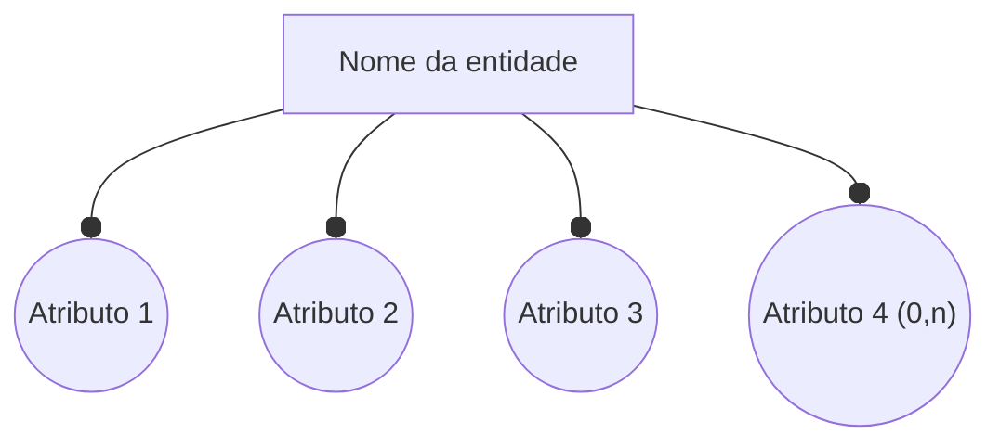
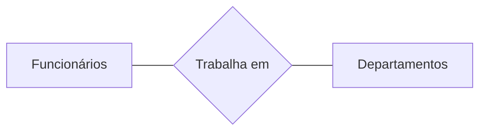
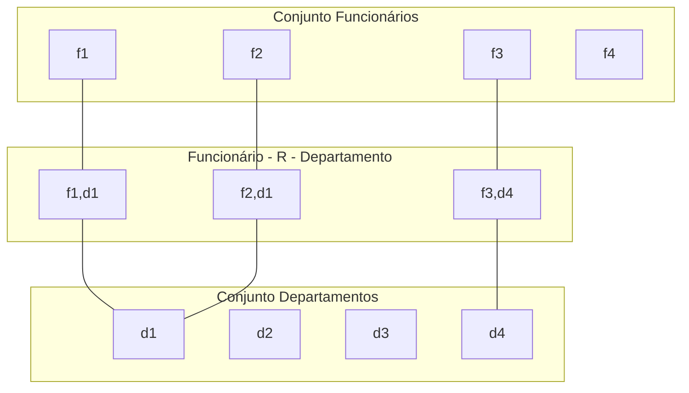
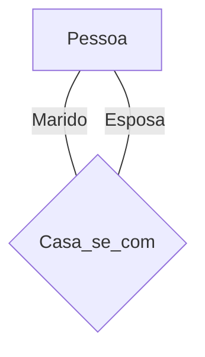
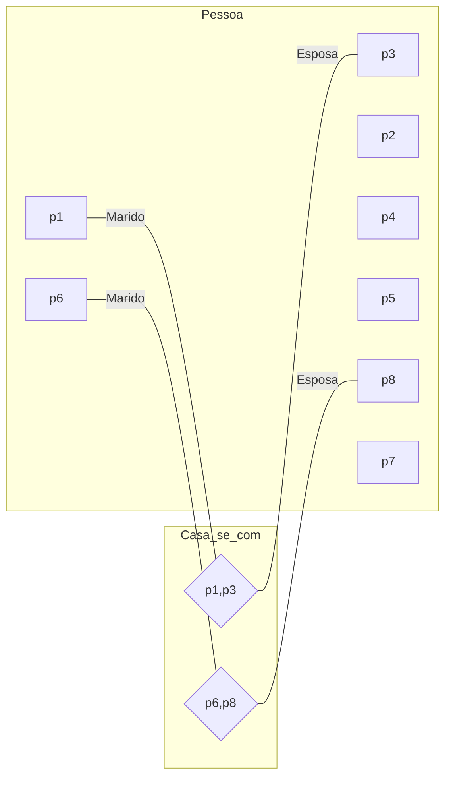
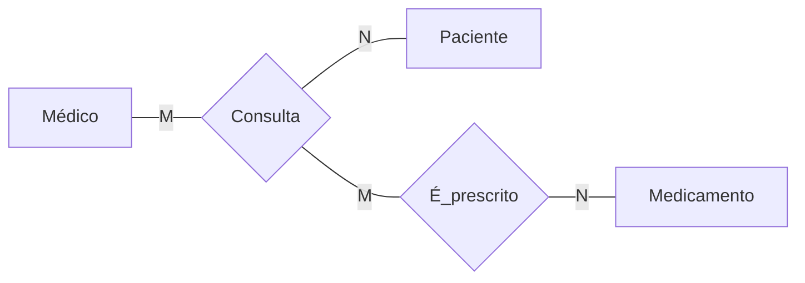
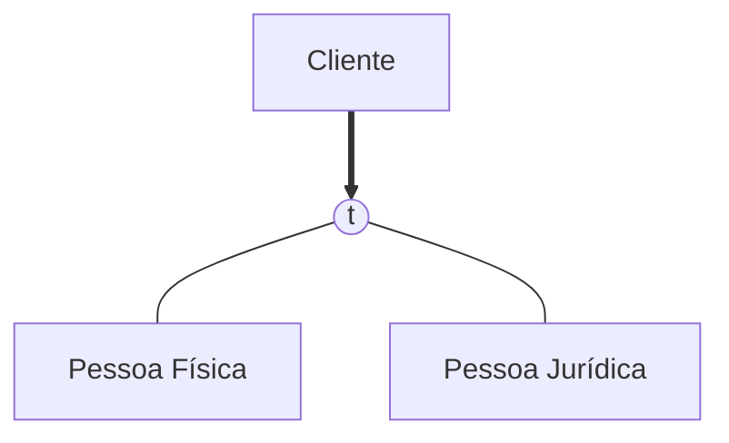
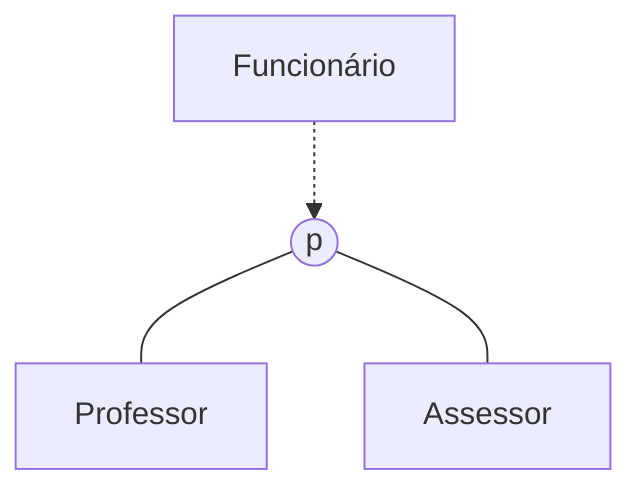

1. [[#Modelo Entidade-Relacionamento]]
3. [[#Entidades e Atributos]]
4. [[#Relações]]
5. [[#Cardinalidade]]

# Modelo Entidade-Relacionamento
- Decreve Objetos (entidades) do domínio da aplicação e suas características (atributos)
- Descreve a interação entre estes elementos (relações)
- Conceito de relação da matemática]

## Definição
Um Modelo Entidade-Relacionamento descreve coisas interrrelacionadas em um domínio do [[conhecimento]]. Um modelo básico ER é composto de *Entidades* e especifica as *Relações* que podem existir entre as entidades.
Em engenharia de software, um modelo ER é geralmente utilizado para representar coisas que uma empresa precisa memorizar para gerenciar [[Processo de Negócio]]. Consequentemente, o modelo ER se torna um [[Modelagem de dados|modelo de dados]] abstrato, que define o [[dado]] ou estrutura de informação que pode ser implementado em um [[Banco de dado]], tipicamente um [[Banco de Dados Relacional]].

## Criado por
Chen, Peter (March 1976). "The Entity-Relationship Model - Toward a Unified View of Data". _ACM Transactions on Database Systems_. **1** (1): 9–36.

# Entidades e Atributos
- Representa objetos do domínio da aplicação sobre os quais deseja-se manter informações armazenadas
	- "coisas" com características
- Como identificar as entidades?
	- A partir de uma descrição, identificar os "participantes", os elementos descritíveis
- E os atributos?
	- Características que descrevem esses objetos
	- Itens que podem ser atômicos ou compostos

## Tipos de Atributos
### Simples (atômico)
Única informação para descrever o atributo
#### Exemplo
- Número do RG
- Número do CPF
- Código de cadastro
- Preço

### Composto
O atributo é caracterizado pela comoposição de vários outros atributos
#### Exemplo
- **Endereço** é um composto de:
	- Rua
	- Número
	- Complemento
	- CEP
	- Cidade
	- Estado

### Derivado
Atributo é obtido através de um atributo já existente
#### Exemplo
- Idade
	- Obtido através da data de nascimento
- Valor líquido
	- Obtido através do valor bruto e desconto

---
### Univalorado
Único valor para o atributo
#### Exemplo
- Número de registro em um cadastro de funcionários

### Multivalorado
O atributo pode conter uma lista de valores (vazia ou não)
#### Exemplo
- Telefones de contato em um cadastro de pessoas

## Representação Gráfica

# Relações 
Associações/relações entre as entidades envolvidas
Matematicamente é uma relação R sobre 2 conjuntos A e B

## Representação Gráfica

## Papéis (Roles) em Relações
Para melhorar a legibilidade de um modelo, pode-se utilizar a notação de definir os papéis que cada entidade assume no relacionamento.
Em geral, isso é utilizado quando se usa o auto-relacionamento, ou seja, uma entidade relaciona-se com ela mesma.

### Auto-relação com Papéis

#### Gráfico simples

#### Gráfico complexo

# Cardinalidade
Cardinalidade indica a quantidade de ocorrências de uma entidade associada a outra. 

Agora temos restrições de quantidades e isso impacta no projeto de todo o sistema

Algumas regras devem ser obedecidas:
- A cardinalidade deve refletir todo o ciclo de vida do sistema
- O sistema deve sempre ser modelado levando-se em consideração a execução permanente do sistema
- Casso isso seja necessário, o relacionamento entre duas entidades deve conter um atributo indicando o tempo

## Cardinalidade (1 : 1)
1 Marido casa-se com 1 Esposa (mas ambos são considerados *Pessoa*)
1 Esposa casa-se com 1 Marido

## Cardinalidade (1 : N)
1 Funcionário trabalha em 1 Departamento
Em um Departamento trabalham *N* Funcionários

## Cardinalidade (M: N)[^1]
1 Médico consulta *N* Pacientes
1 Paciente é consultado por *N* Médicos

### Entidades associativas

## Generalizações e Especializações
Muito utilizado para descriver entidades que tenham características comuns de forma genérica
- Preserva a identidade individual de cada entidade
- Oferece mecanismos de maior abstração para o projeto do banco de dados

### Gráficos
#### Total
O Cliente é OU Pessoa Física OU Pessoa Jurídica

#### Parcial
Funcionário PODE SER  Professor ou PODE SER um Assessor. 
Se não for nenhum dos dois, é um *Funcionário*

## Considerações finais
Diferentes modelos podem ser equivalentes

Dois modelos são equivalentes quando ambos geram o mesmo esquema de Banco de Dados. Em termos lógicos, modelos conceituais são convertidos para o mesmo conjunto de tabelas. Dessa forma, podem ser usadas diferentes formas de representar a mesma coisa.

---
[^1]: *M* ou *N* - não importa. Inglês "Many to Many"