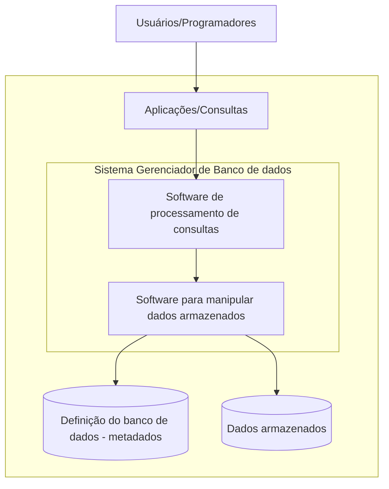

# SGBD

> SGBD é um sistema de software que permite usuários definirem, criarem, manterem e controlarem acesso ao [[Banco de dado]].

\- Connolly e Begg 

## Definição dos dados
- Especificação da estrutura das unidades de armazenamento (tabelas, objetos)
- Tipos de dados
- Restrições de armazenamento (bytes)

## Construção de dados
- Armazenamento dos dados em si através do acesso de algum tipo de armazenamento

## Manipulação de dados
- Funcionalidades para inserir dados nas respectivas unidades de armazenamento, recuperação de dados, alteração de dados que passem a refletir no miniwoeld

## Outras características
- Isolamento de programa e dados
- Independência entre operação do programa e os dados do programa
- Suporte para múltiplas visões
- Diferentes usuários podem ter diferentes formas de acesso (visão) aos dados armazenados
- Uso de catálogos ([[metadados]]) para armazenar informações sobre a descrição da base de dados ([[schema]])

# Exemplos

1. [[MySQL]]
2. [[MariaDB]]
3. [[MongoDB]]
4. [[Cassandra]]
5. PostgreSQL
6. Microsoft SQL Server
7. Oracle Database
8. Microsoft Acess

O acrônimo DBMS é geralmente estendido para indicar o modelo de banco de dados, com RDBMS para o relacional, OODBMS para o orientado a objetos e ORDBMS para o modelo objeto-relacional. Outras extenções podem indicar outras características, como DDBMS para sistemas distribuídos de gerenciamento de banco de dados. 